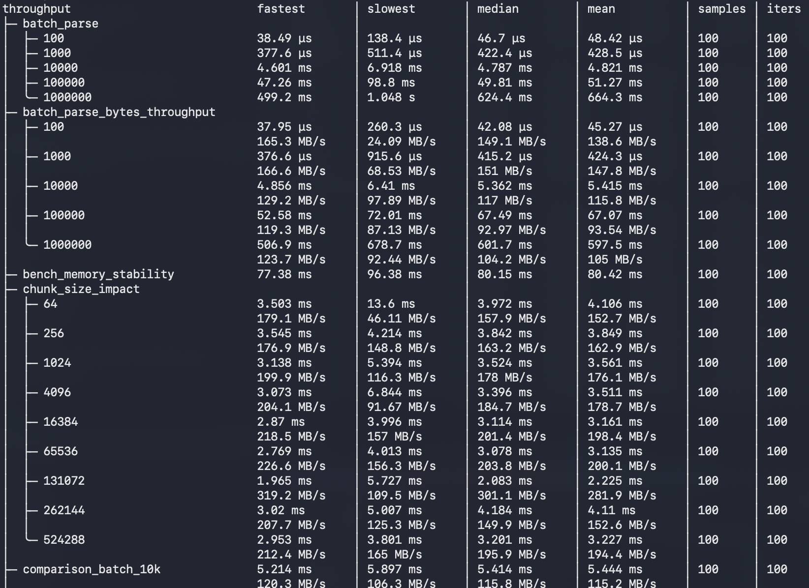

# synkit

[](https://crates.io/crates/synkit)
[](https://docs.rs/synkit)
[](https://github.com/joshua-auchincloss/synkit/actions)
[](https://codspeed.io/joshua-auchincloss/synkit?utm_source=badge)

Generate [syn](https://docs.rs/syn)-like parsing infrastructure from token definitions. Built on [logos](https://github.com/maciejhirsz/logos).

Define tokens once, get: lexer, typed token structs, whitespace-skipping streams, `Parse`/`Peek`/`ToTokens` traits, span tracking, and round-trip formatting.

## When to Use

| Use Case                   | synkit | Alternative          |
| -------------------------- | ------ | -------------------- |
| Custom DSL with formatting | Yes    | -                    |
| Config file parser         | Yes    | serde + format crate |
| Code transformation        | Yes    | -                    |
| Rust source parsing        | No     | syn                  |
| Simple pattern matching    | No     | logos alone          |

## Installation

```toml
[dependencies]
synkit = "0.1"
logos = "0.16"
thiserror = "2"
```

Features: `tokio`, `futures`, `serde`, `std` (default).

## Example

```rust
synkit::parser_kit! {
    error: MyError,
    skip_tokens: [Space],
    tokens: {
        #[token(" ")]
        Space,
        #[token("=")]
        Eq,
        #[regex(r"[a-z]+", |lex| lex.slice().to_string())]
        Ident(String),
        #[regex(r"[0-9]+", |lex| lex.slice().parse().ok())]
        Number(i64),
    },
    delimiters: {},
    span_derives: [Debug, Clone, PartialEq],
    token_derives: [Debug, Clone, PartialEq],
}

// Generated: Token enum, EqToken/IdentToken/NumberToken structs,
// TokenStream, Tok![] macro, Parse/Peek/ToTokens/Diagnostic traits

let mut stream = TokenStream::lex("x = 42")?;
let name: Spanned<IdentToken> = stream.parse()?;
let eq: Spanned<EqToken> = stream.parse()?;
let value: Spanned<NumberToken> = stream.parse()?;
```

## Generated Infrastructure

| Module       | Contents                                            |
| ------------ | --------------------------------------------------- |
| `tokens`     | `Token` enum, `*Token` structs, `Tok![]` macro      |
| `stream`     | `TokenStream` with fork/rewind, whitespace skipping |
| `span`       | `Span`, `Spanned<T>` wrappers                       |
| `traits`     | `Parse`, `Peek`, `ToTokens`, `Diagnostic`           |
| `printer`    | Round-trip formatting                               |
| `delimiters` | `Bracket`, `Brace`, `Paren` extractors              |

## Async Streaming

Incremental parsing for network data and large files:

```rust
use synkit::async_stream::{IncrementalParse, AstStream};

impl IncrementalParse for MyNode {
    fn parse_incremental(tokens: &[Token], checkpoint: &ParseCheckpoint)
        -> Result<(Option<Self>, ParseCheckpoint), MyError>;
}

// Tokens flow through channels, AST nodes emit as parsed
let mut parser = AstStream::<MyNode, Token>::new(token_rx, ast_tx);
parser.run().await?;
```

## Performance

[JSON Example](./examples/jsonl-parser/benches/throughput.rs) benchmarked on a 12-core M4 Pro MacBook Pro peaks at 319MB/s


[CI Benches](https://codspeed.io/joshua-auchincloss/synkit) run on codspeed for generated code performance testing

## Security

synkit is designed for parsing untrusted input. Key safeguards:

| Protection       | Implementation                                                              |
| ---------------- | --------------------------------------------------------------------------- |
| No unsafe code   | Zero `unsafe` blocks in core, macros, and kit crates                        |
| Recursion limits | `ParseConfig::max_recursion_depth` (default: 128) prevents stack overflow   |
| Buffer limits    | `StreamConfig::max_chunk_size` (default: 64KB) caps memory per chunk        |
| Integer safety   | Span arithmetic uses `saturating_sub`/`saturating_add` - no overflow panics |
| Fuzz tested      | Continuous fuzzing via `cargo-fuzz` on lexer and parser paths               |

For streaming scenarios, `StreamError` variants provide explicit handling:

- `ChunkTooLarge` - input chunk exceeds configured maximum
- `BufferOverflow` - token buffer exceeded capacity
- `ResourceLimit` - generic limit exceeded (tokens, depth, etc.)

Configure limits via `ParseConfig` and `StreamConfig`:

```rust
use synkit::{ParseConfig, StreamConfig};

let parse_config = ParseConfig::new()
    .with_max_recursion_depth(64)   // Stricter nesting limit
    .with_max_tokens(10_000);       // Cap token count

let stream_config = StreamConfig {
    max_chunk_size: 16 * 1024,      // 16KB chunks max
    ..StreamConfig::default()
};
```

## Documentation

- [Book](https://joshua-auchincloss.github.io/synkit/)
- [API Reference](https://docs.rs/synkit)
