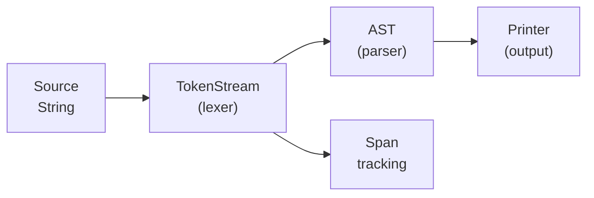

# synkit

A toolkit for building **round-trip parsers** with [logos](https://github.com/maciejhirsz/logos).

## What is synkit?

synkit generates [syn](https://docs.rs/syn)-like parsing infrastructure from token definitions. Define your tokens once, and get:

- **Token enum** with logos lexer integration
- **Token structs** (`EqToken`, `IdentToken`, etc.) with typed values
- **TokenStream** with whitespace skipping, fork/rewind, and span tracking
- **Parse/Peek/ToTokens traits** for building parsers
- **Printer** for round-trip code formatting

## When to use synkit

| Use Case | synkit | Alternative |
|----------|--------|-------------|
| Custom DSL with formatting | ✅ | - |
| Config file parser | ✅ | serde + format-specific crate |
| Code transformation tool | ✅ | - |
| Rust source parsing | ❌ | syn |
| Simple regex matching | ❌ | logos alone |

synkit is ideal when you need:
- **Round-trip fidelity**: Parse → modify → print without losing formatting
- **Span tracking**: Precise error locations and source mapping
- **Type-safe AST**: Strongly-typed nodes with `Spanned<T>` wrappers

## Architecture



## Quick Example

```rust,ignore
use synkit::parser_kit;

synkit::parser_kit! {
    error: MyError,
    skip_tokens: [Space],
    tokens: {
        #[token(" ")]
        Space,

        #[token("=")]
        Eq,

        #[regex(r"[a-z]+", |lex| lex.slice().to_string())]
        Ident(String),
    },
    delimiters: {},
    span_derives: [Debug, Clone, PartialEq],
    token_derives: [Debug, Clone, PartialEq],
}
```

This generates:
- `Token` enum with `Eq`, `Ident(String)` variants
- `EqToken`, `IdentToken` structs
- `TokenStream` with `lex()`, `parse()`, `peek()`
- `Tok![=]`, `Tok![ident]` macros
- `Parse`, `Peek`, `ToTokens`, `Diagnostic` traits
